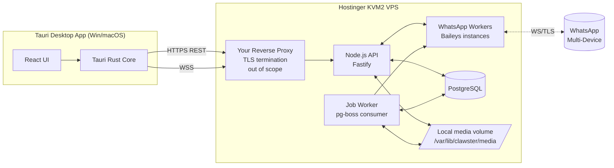
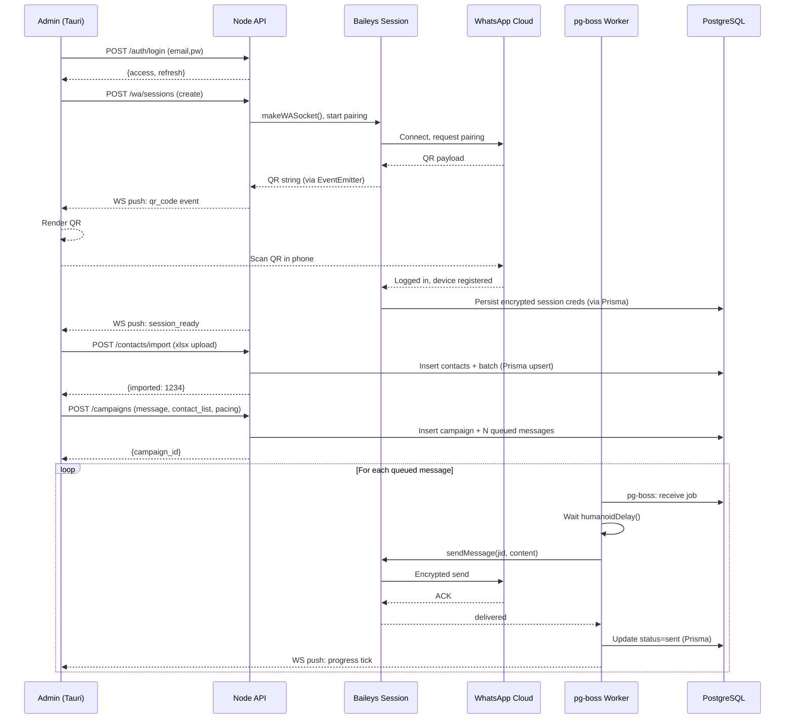
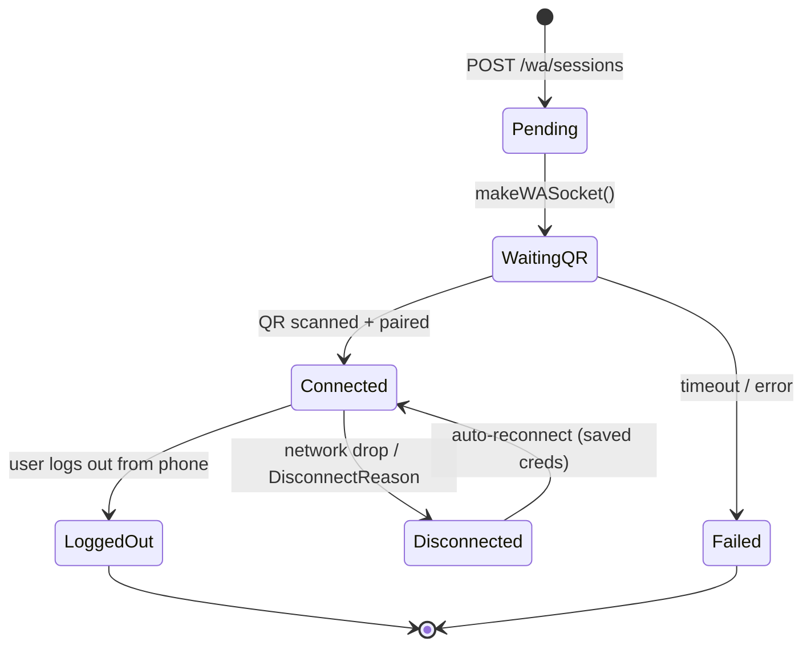

# Clawster — Production Design Document (Node.js Edition)

**Owner:** Khairul (rekabytes)
**Date:** 2026-04-20
**Status:** Draft v1

---

## 1. Project Overview

A desktop-based WhatsApp bulk-messaging tool that lets an admin:

1. Log in to the desktop app (Tauri, Windows + macOS).
2. Link a WhatsApp account by scanning a QR code (WhatsApp Web multi-device protocol).
3. Import a contact list from Excel (phone + name, plus optional custom fields).
4. Compose a message (text + optional media) with variable interpolation (e.g. `{{name}}`).
5. Send in bulk with **humanoid pacing** — randomized delays, typing simulation, daily caps, quiet hours — to reduce ban risk.

The backend is self-hosted on a Hostinger KVM2 VPS. The frontend is a distributable desktop binary.

### Non-goals (v1)
- Multi-language UI (English only v1).
- Inbound conversation handling (no auto-reply bot).
- Message scheduling to specific future timestamps (only immediate + paced send).
- Mobile app.

---

## 2. Tech Stack — Recommendations & Rationale

### 2.1 Backend language: **Node.js (TypeScript)**

| Concern | Node.js + TS | Go |
|---|---|---|
| WhatsApp library | `@whiskeysockets/baileys` — mature, multi-device, actively maintained, written in TS | `whatsmeow` — Go equivalent, also excellent |
| Dev velocity | High — same language as Tauri web UI; shared types possible | Moderate |
| Prisma integration | First-class, official client | Community-only (`prisma-client-go`) |
| Ecosystem | pnpm — huge, fast iteration | Go modules — stable, smaller surface |
| Single-binary deploy | No (Node runtime required; Docker handles this cleanly) | Yes |
| Memory footprint | Moderate | Low |

**Decision: Node.js + TypeScript.** `@whiskeysockets/baileys` is the strongest WhatsApp multi-device library in the JS ecosystem, Prisma has first-class TS support, and sharing types between backend and Tauri frontend eliminates a whole class of contract bugs.

### 2.2 HTTP framework

Pick one:
- **Fastify** — fastest Node HTTP framework, schema-first validation, great TypeScript support. *Recommended.*
- **Express** — most familiar, vast ecosystem, slightly more ceremony for TS types.
- **Hono** — ultralight, fully typed, runs on Node/Bun/Cloudflare Workers — good if you want runtime portability later.

### 2.3 ORM / DB layer: **Prisma**

Prisma is the recommended choice for this stack:
- Schema-first (`schema.prisma`) with auto-generated, fully-typed client.
- Built-in migrations (`prisma migrate dev` / `prisma migrate deploy`).
- Excellent PostgreSQL support including `jsonb`, `bytea`, range types, and raw queries via `prisma.$queryRaw`.
- One caveat: Prisma does not support `INT4RANGE` as a native field — store quiet hours as two `Int` columns (`quiet_start` / `quiet_end`) instead of a PostgreSQL range type.

### 2.4 Final stack

| Layer | Choice |
|---|---|
| Runtime | Node.js 22 LTS (or Bun 1.x as drop-in) |
| Language | TypeScript 5 |
| HTTP framework | Fastify v5 |
| WhatsApp | `@whiskeysockets/baileys` |
| DB | PostgreSQL 16 |
| DB layer | Prisma 6 (migrations + typed client) |
| File storage | Local filesystem (Docker-mounted volume) behind a `Storage` interface |
| Auth | JWT (access + refresh) + Argon2id (`argon2` npm package) |
| Queue | PostgreSQL-backed job queue (`pg-boss`) — no Redis needed v1 |
| Real-time | WebSocket via `@fastify/websocket` (for QR display + campaign progress) |
| Deploy | Docker Compose on Hostinger KVM2 (TLS + reverse proxy handled by your existing VPS setup) |
| Frontend | Tauri 2 (Rust shell + React + TailwindCSS + shadcn/ui) |
| Shared types | `packages/types` monorepo package — consumed by both backend and desktop |

---

## 3. High-Level Architecture



### Component responsibilities

- **Tauri app** — auth, file picking for Excel, QR display, campaign composer, live progress dashboard. Thin client; all logic is server-side.
- **Node.js API (Fastify)** — REST endpoints, WebSocket hub, auth, orchestration. Binds to an internal port (e.g. `127.0.0.1:8080`); your existing reverse proxy terminates TLS in front of it.
- **WhatsApp workers** — one Baileys `makeWASocket` client per active session, long-lived; receives send requests from the job worker.
- **Job worker** — `pg-boss` consumer; pulls queued messages, applies humanoid pacing, dispatches to WA worker.
- **PostgreSQL** — all transactional data + job queue (pg-boss uses its own tables).
- **Local media volume** — Excel uploads and media attachments stored on a Docker-mounted host directory. Access is abstracted behind a `Storage` interface (`put/get/delete/stat`) so S3/MinIO is a drop-in swap later.

---

## 4. End-to-End User Flow



---

## 5. Data Model (Prisma Schema)

Quiet hours are stored as two integer columns (`quietStart` / `quietEnd`) because Prisma does not support PostgreSQL's `INT4RANGE` natively. All UUID primary keys use `@default(dbgenerated("gen_random_uuid()"))`.

```prisma
// schema.prisma
generator client {
  provider = "prisma-client-js"
}

datasource db {
  provider = "postgresql"
  url      = env("DATABASE_URL")
}

model User {
  id           String    @id @default(dbgenerated("gen_random_uuid()")) @db.Uuid
  email        String    @unique
  passwordHash String    @map("password_hash")
  fullName     String?   @map("full_name")
  role         String    @default("admin")
  isActive     Boolean   @default(true) @map("is_active")
  createdAt    DateTime  @default(now()) @map("created_at")
  updatedAt    DateTime  @updatedAt @map("updated_at")

  refreshTokens RefreshToken[]
  waSessions    WaSession[]
  contactLists  ContactList[]
  campaigns     Campaign[]
  mediaAssets   MediaAsset[]
  auditLogs     AuditLog[]

  @@map("users")
}

model RefreshToken {
  id        String    @id @default(dbgenerated("gen_random_uuid()")) @db.Uuid
  userId    String    @map("user_id") @db.Uuid
  tokenHash String    @unique @map("token_hash")
  expiresAt DateTime  @map("expires_at")
  revokedAt DateTime? @map("revoked_at")
  createdAt DateTime  @default(now()) @map("created_at")

  user User @relation(fields: [userId], references: [id], onDelete: Cascade)

  @@map("refresh_tokens")
}

model WaSession {
  id           String    @id @default(dbgenerated("gen_random_uuid()")) @db.Uuid
  userId       String    @map("user_id") @db.Uuid
  displayName  String?   @map("display_name")
  phoneNumber  String?   @map("phone_number")
  jid          String?
  status       String    @default("pending") // pending|connected|disconnected|banned
  sessionBlob  Bytes?    @map("session_blob") // AES-GCM encrypted Baileys creds JSON
  lastSeenAt   DateTime? @map("last_seen_at")
  createdAt    DateTime  @default(now()) @map("created_at")
  updatedAt    DateTime  @updatedAt @map("updated_at")

  user      User       @relation(fields: [userId], references: [id], onDelete: Cascade)
  campaigns Campaign[]

  @@index([userId])
  @@map("wa_sessions")
}

model ContactList {
  id         String   @id @default(dbgenerated("gen_random_uuid()")) @db.Uuid
  userId     String   @map("user_id") @db.Uuid
  name       String
  sourceFile String?  @map("source_file") // relative path under media root
  rowCount   Int      @default(0) @map("row_count")
  createdAt  DateTime @default(now()) @map("created_at")

  user      User      @relation(fields: [userId], references: [id], onDelete: Cascade)
  contacts  Contact[]
  campaigns Campaign[]

  @@map("contact_lists")
}

model Contact {
  id            String   @id @default(dbgenerated("gen_random_uuid()")) @db.Uuid
  contactListId String   @map("contact_list_id") @db.Uuid
  phoneE164     String   @map("phone_e164") // normalized +601...
  name          String?
  customFields  Json     @default("{}") @map("custom_fields")
  isValid       Boolean  @default(true) @map("is_valid")
  createdAt     DateTime @default(now()) @map("created_at")

  contactList       ContactList       @relation(fields: [contactListId], references: [id], onDelete: Cascade)
  campaignMessages  CampaignMessage[]

  @@unique([contactListId, phoneE164])
  @@index([contactListId])
  @@map("contacts")
}

model MediaAsset {
  id          String   @id @default(dbgenerated("gen_random_uuid()")) @db.Uuid
  userId      String   @map("user_id") @db.Uuid
  storagePath String   @map("storage_path")
  mimeType    String   @map("mime_type")
  byteSize    BigInt   @map("byte_size")
  sha256      String
  createdAt   DateTime @default(now()) @map("created_at")

  user      User       @relation(fields: [userId], references: [id], onDelete: Cascade)
  campaigns Campaign[]

  @@map("media_assets")
}

model Campaign {
  id              String    @id @default(dbgenerated("gen_random_uuid()")) @db.Uuid
  userId          String    @map("user_id") @db.Uuid
  waSessionId     String    @map("wa_session_id") @db.Uuid
  contactListId   String    @map("contact_list_id") @db.Uuid
  name            String
  messageTemplate String    @map("message_template")
  mediaAssetId    String?   @map("media_asset_id") @db.Uuid
  minDelaySec     Int       @default(30) @map("min_delay_sec")
  maxDelaySec     Int       @default(180) @map("max_delay_sec")
  dailyCap        Int       @default(500) @map("daily_cap")
  quietStart      Int?      @map("quiet_start") // hour 0-23, e.g. 22
  quietEnd        Int?      @map("quiet_end")   // hour 0-23, e.g. 8
  typingSim       Boolean   @default(true) @map("typing_sim")
  status          String    @default("draft") // draft|running|paused|completed|failed
  startedAt       DateTime? @map("started_at")
  completedAt     DateTime? @map("completed_at")
  createdAt       DateTime  @default(now()) @map("created_at")

  user             User              @relation(fields: [userId], references: [id], onDelete: Cascade)
  waSession        WaSession         @relation(fields: [waSessionId], references: [id])
  contactList      ContactList       @relation(fields: [contactListId], references: [id])
  mediaAsset       MediaAsset?       @relation(fields: [mediaAssetId], references: [id])
  campaignMessages CampaignMessage[]

  @@map("campaigns")
}

model CampaignMessage {
  id           String    @id @default(dbgenerated("gen_random_uuid()")) @db.Uuid
  campaignId   String    @map("campaign_id") @db.Uuid
  contactId    String    @map("contact_id") @db.Uuid
  renderedBody String    @map("rendered_body")
  status       String    @default("queued") // queued|sending|sent|failed|skipped
  attempts     Int       @default(0)
  waMessageId  String?   @map("wa_message_id")
  error        String?
  scheduledAt  DateTime? @map("scheduled_at")
  sentAt       DateTime? @map("sent_at")
  updatedAt    DateTime  @updatedAt @map("updated_at")

  campaign Campaign @relation(fields: [campaignId], references: [id], onDelete: Cascade)
  contact  Contact  @relation(fields: [contactId], references: [id])

  @@index([campaignId])
  @@index([status, scheduledAt])
  @@map("campaign_messages")
}

model AuditLog {
  id        BigInt   @id @default(autoincrement())
  userId    String?  @map("user_id") @db.Uuid
  action    String
  subject   String?
  meta      Json     @default("{}")
  createdAt DateTime @default(now()) @map("created_at")

  user User? @relation(fields: [userId], references: [id])

  @@map("audit_logs")
}
```

### Prisma notes

- Run `prisma migrate dev --name init` locally; `prisma migrate deploy` in CI/Docker entrypoint.
- `sessionBlob` (`Bytes`) stores the AES-GCM encrypted Baileys auth credentials JSON. Decrypt in-process using `MASTER_KEY` from env.
- `customFields` (`Json`) maps directly to JSONB in PostgreSQL — Prisma handles serialisation.
- For raw queue queries (claim next message), use `prisma.$queryRaw` with `FOR UPDATE SKIP LOCKED` rather than pg-boss, or let pg-boss own its own tables alongside Prisma.

---

## 6. REST API Specification

All endpoints are prefixed with `/api/v1`. JSON in/out. Auth via `Authorization: Bearer <access_token>`.

### 6.1 Auth

| Method | Path | Description |
|---|---|---|
| POST | `/auth/register` | (Optional — disable in prod if single-admin) |
| POST | `/auth/login` | Exchange email+password for tokens |
| POST | `/auth/refresh` | Exchange refresh for new access token |
| POST | `/auth/logout` | Revoke refresh token |
| GET  | `/auth/me` | Current user profile |

### 6.2 WhatsApp sessions

| Method | Path | Description |
|---|---|---|
| GET    | `/wa/sessions` | List user sessions |
| POST   | `/wa/sessions` | Create new session (returns session id; QR arrives via WS) |
| GET    | `/wa/sessions/:id` | Session detail + status |
| DELETE | `/wa/sessions/:id` | Logout + delete |
| POST   | `/wa/sessions/:id/reconnect` | Resume after restart |

### 6.3 Contacts

| Method | Path | Description |
|---|---|---|
| POST   | `/contacts/import` | Multipart: xlsx file + list_name → returns list_id, row_count |
| GET    | `/contact-lists` | Paginated |
| GET    | `/contact-lists/:id` | Detail |
| GET    | `/contact-lists/:id/contacts` | Paginated contacts |
| DELETE | `/contact-lists/:id` | Delete list + contacts |

### 6.4 Media

| Method | Path | Description |
|---|---|---|
| POST   | `/media` | Multipart upload → saves to media volume, returns asset id |
| GET    | `/media/:id` | Metadata |
| GET    | `/media/:id/download` | Streams the file (authenticated; `Content-Type` from DB) |

### 6.5 Campaigns

| Method | Path | Description |
|---|---|---|
| POST   | `/campaigns` | Create (draft) |
| GET    | `/campaigns` | List |
| GET    | `/campaigns/:id` | Detail + aggregate progress |
| POST   | `/campaigns/:id/start` | Move draft → running |
| POST   | `/campaigns/:id/pause` | Running → paused |
| POST   | `/campaigns/:id/resume` | Paused → running |
| POST   | `/campaigns/:id/cancel` | Stop |
| GET    | `/campaigns/:id/messages` | Paginated per-recipient status |

### 6.6 WebSocket

`wss://api.yourdomain.com/api/v1/ws?token=<access>`

Server → client events:
```json
{"type":"wa.qr","session_id":"...","qr":"2@abcd..."}
{"type":"wa.status","session_id":"...","status":"connected","phone_number":"+60..."}
{"type":"campaign.progress","campaign_id":"...","sent":42,"failed":1,"remaining":958}
{"type":"campaign.done","campaign_id":"...","sent":999,"failed":1}
```

### 6.7 Sample fetch calls (Tauri / browser)

```ts
// lib/api.ts
const API = "https://api.yourdomain.com/api/v1";

export async function login(email: string, password: string) {
  const r = await fetch(`${API}/auth/login`, {
    method: "POST",
    headers: { "Content-Type": "application/json" },
    body: JSON.stringify({ email, password }),
  });
  if (!r.ok) throw new Error(`login failed: ${r.status}`);
  return r.json() as Promise<{ access_token: string; refresh_token: string }>;
}

export async function createSession(access: string, displayName: string) {
  const r = await fetch(`${API}/wa/sessions`, {
    method: "POST",
    headers: {
      "Content-Type": "application/json",
      Authorization: `Bearer ${access}`,
    },
    body: JSON.stringify({ display_name: displayName }),
  });
  return r.json(); // { id, status: "pending" }
}

export async function importContacts(access: string, file: File, listName: string) {
  const fd = new FormData();
  fd.append("file", file);
  fd.append("name", listName);
  const r = await fetch(`${API}/contacts/import`, {
    method: "POST",
    headers: { Authorization: `Bearer ${access}` },
    body: fd,
  });
  return r.json(); // { list_id, row_count, invalid: [...] }
}

export async function createCampaign(access: string, payload: {
  name: string;
  wa_session_id: string;
  contact_list_id: string;
  message_template: string;
  media_asset_id?: string;
  min_delay_sec?: number;
  max_delay_sec?: number;
  daily_cap?: number;
  quiet_start?: number;
  quiet_end?: number;
  typing_sim?: boolean;
}) {
  const r = await fetch(`${API}/campaigns`, {
    method: "POST",
    headers: {
      "Content-Type": "application/json",
      Authorization: `Bearer ${access}`,
    },
    body: JSON.stringify(payload),
  });
  return r.json(); // { id, status: "draft" }
}

export async function startCampaign(access: string, id: string) {
  const r = await fetch(`${API}/campaigns/${id}/start`, {
    method: "POST",
    headers: { Authorization: `Bearer ${access}` },
  });
  return r.json();
}

export function openEvents(access: string, onEvent: (e: unknown) => void) {
  const ws = new WebSocket(`wss://api.yourdomain.com/api/v1/ws?token=${access}`);
  ws.onmessage = (m) => onEvent(JSON.parse(m.data));
  return ws;
}
```

---

## 7. WhatsApp Session Lifecycle (Baileys)



**Implementation notes:**

- Baileys stores auth state as a JSON credentials object. On pairing, encrypt the JSON with AES-GCM (master key from env) and persist as `session_blob` bytes via Prisma. On reconnect, decrypt and pass to `useSingleFileAuthState` or a custom `AuthenticationCreds` implementation backed by your DB.
- Keep a session registry `Map<string, WASocket>` in a singleton module (e.g. `src/wa/registry.ts`). Access from both API handlers and the job worker via inter-process communication or, for single-process deployment, a shared in-memory map.
- Listen for Baileys `connection.update` events to push `wa.qr` and `wa.status` WebSocket events to the client.
- On server restart, query `wa_sessions` where `status = 'connected'` and call `makeWASocket` with the decrypted credentials for each.
- For multi-process (API + worker as separate Docker services), use a lightweight pub/sub channel. PostgreSQL `LISTEN/NOTIFY` works well and avoids adding Redis v1.

---

## 8. Humanoid Messaging Engine

The core differentiator. Bad pacing = fast ban.

### 8.1 Policies (configurable per campaign)

| Knob | Default | Purpose |
|---|---|---|
| `min_delay_sec` | 30 | Floor between sends |
| `max_delay_sec` | 180 | Ceiling (random uniform) |
| `jitter` | +/- 15% | Additional noise on each delay |
| `daily_cap` | 500 | Hard stop per session per rolling 24h |
| `hourly_cap` | 60 | Rolling 1h limit |
| `quiet_start` | 22 | Pause after this hour (local time) |
| `quiet_end` | 8 | Resume from this hour (local time) |
| `typing_sim` | true | Send `presenceSubscribe` + `sendPresenceUpdate('composing')` for 2–6s before message |
| `batch_size` | 50 | After N sends, insert a long pause (10–30 min) |
| `warmup_mode` | false | If true, scale caps from 20/day → target over 7 days |

### 8.2 Worker pseudocode (TypeScript)

```ts
// worker/sender.ts
import PgBoss from "pg-boss";
import { prisma } from "../db/client";
import { registry } from "../wa/registry";

const boss = new PgBoss(process.env.DATABASE_URL!);

boss.work<{ messageId: string }>("send-message", async (job) => {
  const msg = await prisma.campaignMessage.findUniqueOrThrow({
    where: { id: job.data.messageId },
    include: { campaign: true, contact: true },
  });

  if (capExceeded(msg.campaign) || withinQuietHours(msg.campaign)) {
    const retryAt = nextAllowedTime(msg.campaign);
    await prisma.campaignMessage.update({
      where: { id: msg.id },
      data: { scheduledAt: retryAt },
    });
    throw new Error("deferred"); // pg-boss will retry at scheduledAt
  }

  const socket = registry.get(msg.campaign.waSessionId);
  if (!socket) throw new Error("session unavailable");

  if (msg.campaign.typingSim) {
    await socket.sendPresenceUpdate("composing", msg.contact.phoneE164 + "@s.whatsapp.net");
    await sleep(randBetween(2000, 6000));
  }

  const result = await socket.sendMessage(msg.contact.phoneE164 + "@s.whatsapp.net", {
    text: msg.renderedBody,
  });

  await prisma.campaignMessage.update({
    where: { id: msg.id },
    data: { status: "sent", waMessageId: result?.key?.id, sentAt: new Date() },
  });

  broadcastProgress(msg.campaign.id);

  const delay = addJitter(randBetween(msg.campaign.minDelaySec, msg.campaign.maxDelaySec), 0.15);
  // enqueue next message from this campaign with delay
  await scheduleNextMessage(msg.campaign, delay);
});
```

### 8.3 Queue backing

Use **pg-boss** (PostgreSQL-backed job queue):
- Runs entirely on your existing PostgreSQL instance — no Redis.
- Supports delayed jobs, retries, expiry, and `singletonKey` to prevent duplicate sends.
- `boss.sendAfter(queue, data, options, delaySeconds)` drives humanoid pacing natively.
- pg-boss creates and manages its own schema (`pgboss.*`) alongside your Prisma-managed tables.

### 8.4 Backoff on errors

- `rate-limited` → exponential backoff starting 5 min (`boss.fail` with retry delay).
- `not-on-whatsapp` → mark `skipped`, complete job without retry.
- `banned` → set campaign `status = 'failed'`, halt all pending jobs for that campaign, emit WS alert.

---

## 9. Excel Import Pipeline

**Expected columns** (case-insensitive, flexible order):
- `phone` (required) — any format; normalize to E.164.
- `name` (optional) — used for `{{name}}` interpolation.
- Any additional columns → stored in `contacts.customFields` JSON, usable as `{{column_name}}`.

**Flow:**

1. Upload multipart to `POST /contacts/import`.
2. Parse with `exceljs` (streaming for large files).
3. Normalize phones with `google-libphonenumber` (Malaysia default region, overridable via a `defaultRegion` query param).
4. Dedup within batch; upsert into `contacts` via `prisma.contact.upsert` on `(contactListId, phoneE164)`.
5. Save original xlsx under the local media root (e.g. `imports/<uuid>.xlsx`) via the `Storage` interface.
6. Return `{ list_id, total, imported, invalid: [{ row, reason }] }`.

---

## 10. Security

- **Auth**: JWT access (15 min) + refresh (14 days, rotating, hash-only in DB via `bcrypt` or `crypto.createHash('sha256')`).
- **Passwords**: Argon2id (`argon2` npm package — `argon2.hash(pw, { type: argon2.argon2id, memoryCost: 65536, timeCost: 3, parallelism: 2 })`).
- **Transport**: TLS + the public-facing reverse proxy are handled by your existing VPS setup (out of scope). The Node API binds to `127.0.0.1:8080` inside the VPS — never expose it directly to the public internet.
- **Secrets**: `.env` on the VPS, never in Git. Consider `age` or `sops` for backup.
- **WA session blobs**: AES-GCM encrypted with master key from env (`crypto.subtle` or `node:crypto`).
- **Rate limiting**: Per-IP at your reverse proxy; per-user via `@fastify/rate-limit` at API middleware.
- **CORS**: Restrict to Tauri origin (`tauri://localhost` / custom scheme) via `@fastify/cors`.
- **Input validation**: Fastify JSON Schema validation on every route (or `zod` + `fastify-type-provider-zod`).
- **Audit log**: Every auth event, session create/delete, campaign state change — written via Prisma in the same transaction where possible.
- **CSRF**: Not needed for bearer-token API, but double-submit cookie if you ever expose a browser session.
- **File uploads**: Validate MIME type via `file-type` (sniff magic bytes, don't trust `Content-Type`), cap size (25MB xlsx, 16MB media per WA limit) via Fastify's `bodyLimit`.

---

## 11. Observability

- **Structured logs**: `pino` (built into Fastify) → stdout, scraped by Docker → optional Loki.
- **Metrics**: `prom-client` → `/metrics` endpoint (campaign throughput, error rates, queue depth).
- **Tracing**: OpenTelemetry stub (`@opentelemetry/sdk-node`), optional v2.
- **Healthcheck**: `/healthz` (liveness), `/readyz` (DB reachable via `prisma.$queryRaw\`SELECT 1\`` + media directory writable + at least one WA session connected).

---

## 12. Deployment — Hostinger KVM2

### 12.1 VPS baseline

- Ubuntu 22.04 LTS, 2 vCPU, 4–8GB RAM, 100GB SSD (KVM2 tier).
- `ufw` allow 22, 80, 443. Everything else internal.
- Non-root user with sudo; disable password SSH, keys only.
- Unattended upgrades on.
- Swap 2GB (Postgres likes to have some headroom).

### 12.2 docker-compose.yml

TLS and the public reverse proxy live outside this compose file. The `api` service binds to `127.0.0.1:8080`.

```yaml
services:
  api:
    build:
      context: ./backend
      dockerfile: Dockerfile
    env_file: .env
    ports: ["127.0.0.1:8080:8080"]
    volumes:
      - media_data:/var/lib/clawster/media
    depends_on:
      postgres:
        condition: service_healthy
    restart: unless-stopped
    command: ["node", "dist/cmd/api/main.js"]

  worker:
    build:
      context: ./backend
      dockerfile: Dockerfile
    env_file: .env
    volumes:
      - media_data:/var/lib/clawster/media
    depends_on:
      postgres:
        condition: service_healthy
    restart: unless-stopped
    command: ["node", "dist/cmd/worker/main.js"]

  postgres:
    image: postgres:16
    environment:
      POSTGRES_USER: ${PG_USER}
      POSTGRES_PASSWORD: ${PG_PASSWORD}
      POSTGRES_DB: ${PG_DB}
    volumes: [pg_data:/var/lib/postgresql/data]
    restart: unless-stopped
    healthcheck:
      test: ["CMD-SHELL", "pg_isready -U ${PG_USER}"]
      interval: 5s
      timeout: 5s
      retries: 5

volumes:
  pg_data:
  media_data:
```

### 12.3 Dockerfile

```dockerfile
FROM node:22-alpine AS builder
WORKDIR /app
COPY package*.json ./
RUN npm ci
COPY . .
RUN npx prisma generate
RUN npm run build

FROM node:22-alpine
WORKDIR /app
COPY --from=builder /app/dist ./dist
COPY --from=builder /app/node_modules ./node_modules
COPY --from=builder /app/prisma ./prisma
EXPOSE 8080
```

The Docker entrypoint for the `api` service should run `npx prisma migrate deploy` before starting if you want automatic migration on deploy. Alternatively, run migrations as a separate one-shot container in your CI/CD pipeline.

### 12.4 Backups

- `pg_dump` nightly to `/var/backups/clawster/pg/YYYY-MM-DD.sql.gz`, 30-day retention on-disk.
- Media volume: nightly `tar --zstd` of `/var/lib/clawster/media/` → `/var/backups/clawster/media/`.
- `rsync` (or `rclone` to Backblaze B2 / another VPS) both of the above off-box every night.
- Keep an encrypted copy of `.env` offline.

---

## 13. Tauri Desktop App

### 13.1 Structure

```
desktop/
  src-tauri/        # Rust shell
    tauri.conf.json
    src/main.rs
  src/              # web UI (React + TS + Tailwind)
    pages/
      Login.tsx
      Sessions.tsx       # list + "link new device" (QR)
      Contacts.tsx       # upload + list manager
      CampaignNew.tsx    # compose + pacing knobs
      CampaignDetail.tsx # live progress via WS
    lib/api.ts
    lib/ws.ts
```

### 13.2 Shared types (monorepo)

Because both backend and frontend are TypeScript, extract shared DTOs/enums into a `packages/types` workspace package:

```ts
// packages/types/src/index.ts
export type CampaignStatus = "draft" | "running" | "paused" | "completed" | "failed";
export type WaSessionStatus = "pending" | "connected" | "disconnected" | "banned";
export type MessageStatus = "queued" | "sending" | "sent" | "failed" | "skipped";

export interface WsEvent {
  type: "wa.qr" | "wa.status" | "campaign.progress" | "campaign.done";
  [key: string]: unknown;
}
```

Import `@clawster/types` in both `backend/` and `desktop/src/` — no schema drift.

### 13.3 Secrets

- Use `tauri-plugin-store` for tokens, or OS keychain via `tauri-plugin-keyring`.
- Never persist plaintext refresh tokens on disk.

### 13.4 Auto-update

- Tauri's built-in updater, signed releases, manifest hosted on VPS or GitHub Releases.

### 13.5 Packaging

- Windows: `.msi` (WiX) via `cargo tauri build --target x86_64-pc-windows-msvc`.
- macOS: `.dmg`, notarized via Apple Developer ID ($99/yr). Without it the user sees scary warnings.

---

## 14. Phased Roadmap

Each phase delivers a **complete vertical slice** — backend + desktop built and tested together. Nothing ships backend-only or desktop-only. Aim for ~1–2 weeks per phase.

> **Phase 0 is complete.** Monorepo (pnpm workspaces), Prisma schema, Fastify stub, Tauri scaffold, Docker Compose (Postgres only), and desktop→backend health check are all in place.

---

### Phase 1 — Auth slice (≈1 week)

**Backend**
- `users` + `refresh_tokens` + `audit_logs` Prisma migration
- `POST /api/v1/auth/login` — Argon2id verify, issue JWT access (15 min) + refresh (14 days)
- `POST /api/v1/auth/refresh` — rotate refresh token
- `POST /api/v1/auth/logout` — revoke refresh token
- `GET  /api/v1/auth/me` — current user profile
- JWT verify middleware applied to all protected routes
- CLI seed script to create the first admin (`packages/backend/src/cmd/seed.ts`)

**Desktop**
- `Login.tsx` page — email + password form
- `tauri-plugin-store` for persisting access + refresh tokens (never plaintext on disk)
- Auth context / protected route — redirect to login if no valid token
- Auto-refresh: call `/auth/refresh` when access token is near expiry
- `src/lib/api.ts` — base fetch wrapper that attaches `Authorization` header

**Exit criteria:** Open app → login form → submit valid credentials → land on dashboard placeholder. Refresh the app → stays logged in (token restored from store). Invalid password → shows error.

---

### Phase 2 — WhatsApp session slice (≈1.5 weeks)

**Backend**
- `wa_sessions` Prisma migration
- Integrate `@whiskeysockets/baileys` with custom Prisma-backed auth state (encrypted `sessionBlob`)
- `POST /api/v1/wa/sessions` — spawn Baileys client, begin QR pairing
- `GET  /api/v1/wa/sessions` / `GET ./:id` / `DELETE ./:id`
- WebSocket hub (`@fastify/websocket`) — emit `wa.qr` and `wa.status` events
- On server restart: reconnect all `status = 'connected'` sessions automatically

**Desktop**
- `Sessions.tsx` — list linked devices + status badges
- "Link new device" modal — opens WebSocket, renders QR from `wa.qr` event (via `qrcode` npm lib)
- Live status update when `wa.status = connected` arrives
- Disconnect button

**Exit criteria:** Click "Link device" → QR appears in desktop window → scan on phone → status badge turns green. Restart backend → session reconnects automatically.

---

### Phase 3 — Contacts slice (≈1 week)

**Backend**
- `contact_lists` + `contacts` + `media_assets` Prisma migration
- `POST /api/v1/contacts/import` — multipart xlsx upload, `exceljs` stream parse, `google-libphonenumber` E.164 normalisation, upsert into `contacts`, save file via `Storage` interface
- `GET  /api/v1/contact-lists` (paginated) / `GET ./:id` / `DELETE ./:id`
- `GET  /api/v1/contact-lists/:id/contacts` (paginated)
- `POST /api/v1/media` — multipart upload; `GET /api/v1/media/:id/download` — authenticated stream

**Desktop**
- `Contacts.tsx` — xlsx drag-drop zone, preview first 20 rows before import
- Import result: count of imported vs invalid rows, inline error list
- Contact list manager — paginated list, delete

**Exit criteria:** Drag a 5 k-row xlsx onto the desktop app → preview appears → confirm → list saved → invalid rows shown with reason.

---

### Phase 4 — Campaign slice (≈2 weeks)

**Backend**
- `campaigns` + `campaign_messages` Prisma migration
- Campaign CRUD — `draft → running → paused → completed / failed` state machine
- On `start`: expand contact list × message template → insert `campaign_messages`
- `pg-boss` worker: `SELECT … FOR UPDATE SKIP LOCKED`, humanoid pacer (delays, jitter, caps, quiet hours, typing sim, batch pauses)
- Error taxonomy: rate-limited → backoff, not-on-whatsapp → skip, banned → halt + alert
- WebSocket: `campaign.progress` + `campaign.done` events
- `POST ./:id/pause` / `./:id/resume` / `./:id/cancel`

**Desktop**
- `CampaignNew.tsx` — pick WA session + contact list + optional media, write `{{name}}` template, tune pacing knobs
- `CampaignDetail.tsx` — live progress bar + per-recipient status table fed by WebSocket
- Pause / resume / cancel buttons

**Exit criteria:** Create campaign with 200 contacts → start → watch progress tick in real time in the desktop app → pause mid-way → resume → completes cleanly. Pacing logs confirm humanoid delays.

---

### Phase 5 — Hardening + packaging (≈1 week)

- Rate limiting per endpoint + per user (`@fastify/rate-limit`)
- Audit log coverage review
- `prom-client` metrics endpoint (`/metrics`)
- Automated backups: nightly `pg_dump` + media `tar` → `rclone` to off-site
- Error alerting: Telegram bot notification on campaign halt / WA ban
- Tauri auto-updater configured, signed releases
- Windows installer signed; macOS `.dmg` notarized (Apple Developer ID)
- Penetration-test checklist: SQLi, IDOR, file upload abuse, auth bypass

**Exit criteria:** 72 h soak test (warm-up campaign 20 → 200 msgs/day), no crashes, backups landing, alerts fire on induced failures. Fresh Windows + macOS machines install and auto-update successfully.

---

## 15. Legal, Compliance & Ban-Risk Notes

This is the part most projects in this category under-plan, and it's the one that actually kills the product.

- **WhatsApp ToS.** Unofficial automation of consumer WhatsApp accounts violates WhatsApp's Terms of Service. WA can and does ban numbers at its discretion. Users should know this. If you want a fully compliant product, use **WhatsApp Business API / Cloud API** via an official BSP (Meta, 360dialog, Twilio) — paid, template-gated, requires opt-in.
- **Consent.** Advise users (and enforce via UI copy) that recipients must have opted in. Unsolicited bulk messaging is illegal under PDPA (Malaysia), GDPR (EU), TCPA (US), etc.
- **Opt-out.** Include an opt-out line in every template; add a simple "STOP" handler (Baileys incoming message listener can flag contacts as do-not-contact).
- **Rate realism.** Even with humanoid pacing, new numbers should warm up (20/day → scale). Old, well-used numbers tolerate more. Do not market "unlimited."
- **In-app disclosures.** Before first send, show a consent modal the admin must accept: "I confirm recipients have opted in to receive messages; I accept risk of account suspension."
- **No media with links** on cold sends — WA's ML flags these fast.

---

## 16. Open Questions (for you to decide before Phase 1)

1. **Single admin or multi-tenant?** Current design supports multiple users; set a toggle to disable `/auth/register`.
2. **Multiple WA sessions per admin?** Schema supports it; Tauri UI should either limit or allow a session picker.
3. **Template variables beyond `{{name}}`?** Confirm syntax (`{{name}}` vs `{name}`) and which Excel columns become variables by default.
4. **Quiet hours timezone.** Per-campaign timezone field or global? Assumed per-campaign, `Asia/Kuala_Lumpur` default.
5. **Inbound handling.** v1 ignores inbound entirely. If you want opt-out keywords, add a Baileys `messages.upsert` consumer.
6. **Single-process vs split (API + worker)?** Starting as a single process (API + pg-boss worker in one Node app) is simpler for v1; split into two Docker services when you need independent scaling.
7. **Billing / licensing.** Out of scope v1; mention if you plan a SaaS later.

---

## 17. Repo layout

```
clawster/                        # repo root
├── package.json                 # pnpm workspace root
├── pnpm-workspace.yaml          # packages: ["packages/*"]
├── tsconfig.base.json           # shared TS compiler base
├── .npmrc
├── .gitignore
├── packages/
│   ├── db/                      # @clawster/db
│   │   ├── package.json
│   │   ├── tsconfig.json
│   │   ├── .env.example         # DATABASE_URL
│   │   ├── prisma/
│   │   │   ├── schema.prisma
│   │   │   └── migrations/
│   │   └── src/
│   │       ├── client.ts        # Prisma singleton
│   │       └── index.ts         # re-exports
│   ├── backend/                 # @clawster/backend
│   │   ├── package.json
│   │   ├── tsconfig.json
│   │   ├── Dockerfile
│   │   └── src/
│   │       ├── index.ts         # Fastify entry point
│   │       ├── modules/
│   │       │   ├── auth/
│   │       │   ├── wa/          # Baileys integration + registry
│   │       │   ├── contacts/
│   │       │   ├── campaigns/
│   │       │   ├── worker/      # pg-boss consumers + humanoid pacer
│   │       │   └── storage/     # Storage interface + localfs impl
│   │       └── plugins/         # Fastify plugins: auth, ws, ratelimit
│   └── desktop/                 # @clawster/desktop
│       ├── package.json
│       ├── tsconfig.json
│       ├── vite.config.ts
│       ├── index.html
│       ├── src/
│       │   ├── main.tsx
│       │   ├── pages/
│       │   │   ├── Login.tsx
│       │   │   ├── Sessions.tsx
│       │   │   ├── Contacts.tsx
│       │   │   ├── CampaignNew.tsx
│       │   │   └── CampaignDetail.tsx
│       │   └── lib/
│       │       ├── api.ts
│       │       └── ws.ts
│       └── src-tauri/           # init with: cargo tauri init
├── infra/
│   ├── docker-compose.yml
│   ├── .env.example
│   └── scripts/                 # backup.sh, restore.sh
├── docs/
│   └── prod-nodejs.md           # this file
└── .github/
    └── workflows/
```

### pnpm workspace commands

```bash
pnpm install                          # install all packages
pnpm --filter @clawster/db generate # run prisma generate
pnpm --filter @clawster/db migrate:dev --name init
pnpm --filter @clawster/backend dev # start API with tsx watch
pnpm --filter @clawster/desktop dev # start Vite dev server
pnpm -r typecheck                     # typecheck all packages
pnpm -r build                         # build all packages
```

---

## 18. TL;DR decisions to confirm

- Backend: **Node.js 22 + TypeScript + Fastify + Baileys + Prisma + PostgreSQL + local file storage** (behind a `Storage` interface — S3/MinIO is an easy swap later).
- Queue: **pg-boss — PostgreSQL-backed, no Redis v1.**
- Frontend: **Tauri 2 + React + Tailwind + shadcn**.
- Monorepo: **pnpm workspaces** — `packages/db` (Prisma), `packages/backend` (Fastify), `packages/desktop` (Tauri/React). Prisma types shared directly via `@clawster/db` import.
- Hosting: **Single KVM2 VPS, Docker Compose**; TLS + public reverse proxy handled by your existing VPS setup.
- Ship order: Phases 0 → 7 above. MVP is complete at end of Phase 5; Phases 6–7 are launch-ready polish.
